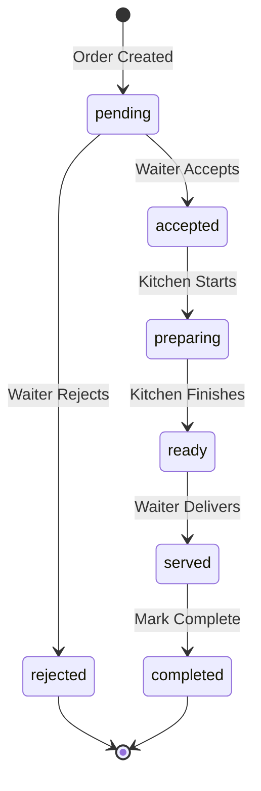

# Order & Session API Documentation

## Table of Contents
1. [Overview](#overview)
2. [Architecture](#architecture)
3. [API by Role](#api-by-role)
4. [Session API](#session-api)
5. [Order API](#order-api)
6. [WebSocket Real-time Events](#websocket-real-time-events)
7. [Order Status State Machine](#order-status-state-machine)
8. [Complete Workflow Examples](#complete-workflow-examples)
9. [Error Handling](#error-handling)
10. [Best Practices](#best-practices)

---

## Overview

Hệ thống Order & Session quản lý toàn bộ quy trình từ khi khách ngồi bàn đến khi thanh toán:

- **Session (Table Session)**: Đại diện cho một phiên phục vụ tại bàn, gom nhóm nhiều orders
- **Order**: Đơn hàng riêng lẻ trong session, có thể đặt nhiều lần trong cùng một phiên
- **Real-time Updates**: WebSocket cập nhật trạng thái real-time cho Customer, Kitchen, Waiter

### Key Features
- ✅ Multi-order per session (đặt nhiều lần trong 1 phiên)
- ✅ Real-time order tracking via WebSocket
- ✅ State machine validation (đảm bảo luồng xử lý đúng)
- ✅ Kitchen Display System (KDS) integration
- ✅ Waiter management & notifications
- ✅ Combined payment at session level

---

## Architecture

```
┌─────────────────┐
│    Customer     │ ◄──── WebSocket: Order status updates
│   (Frontend)    │
└────────┬────────┘
         │
         │ 1. Create Session
         │ 2. Place Orders (multiple times)
         │ 3. Track status
         │ 4. Complete Session (Payment)
         ▼
┌──────────────────────┐
│   Session API        │
│  /api/sessions       │
└──────────┬───────────┘
           │
           │ Creates & manages
           ▼
┌──────────────────────┐       WebSocket        ┌─────────────┐
│     Order API        │ ◄───────────────────► │   Kitchen   │
│   /api/orders        │      New orders        │     KDS     │
└──────────┬───────────┘      Status updates    └─────────────┘
           │                                            │
           │                  WebSocket                 │
           └────────────────────────────────────────────┘
                         Order ready notifications
                                   │
                                   ▼
                            ┌─────────────┐
                            │   Waiter    │
                            │  Dashboard  │
                            └─────────────┘
```

---

## API by Role

### 🧑‍💼 Customer APIs

**Màn hình Customer cần:**

| API Endpoint | Method | Purpose | Access |
|--------------|--------|---------|--------|
| `POST /api/sessions` | POST | Tạo session khi scan QR | Public |
| `GET /api/sessions/table/:tableId` | GET | Lấy session hiện tại của bàn | Public |
| `GET /api/sessions/:id` | GET | Xem chi tiết session | Public |
| `POST /api/sessions/:id/orders` | POST | Đặt món (tạo order) | Public |
| `GET /api/orders/table/:tableId` | GET | Xem order của bàn | Public |
| `GET /api/orders/:id` | GET | Xem chi tiết order | Public |
| `POST /api/sessions/:id/complete` | POST | Thanh toán & kết thúc session | Public |

**WebSocket Events (Customer):**
- `join-table` - Join room để nhận updates
- `new-order` - Xác nhận order đã tạo
- `order-status-updated` - Cập nhật trạng thái order
- `order-ready` - Món ăn đã sẵn sàng
- `item-status-updated` - Cập nhật từng món
- `order-rejected` - Order bị từ chối
- `session-completed` - Session đã thanh toán

---

### 👨‍🍳 Waiter APIs

**Màn hình Waiter cần:**

| API Endpoint | Method | Purpose | Access |
|--------------|--------|---------|--------|
| `GET /api/orders` | GET | Xem tất cả orders (có filter) | Private |
| `GET /api/orders/:id` | GET | Xem chi tiết order | Private |
| `POST /api/orders/:id/accept` | POST | Chấp nhận order | Private (Waiter) |
| `POST /api/orders/:id/reject` | POST | Từ chối order | Private (Waiter) |
| `PATCH /api/orders/:id/status` | PATCH | Cập nhật trạng thái order | Private (Waiter) |
| `POST /api/orders/:id/complete` | POST | Đánh dấu order hoàn thành | Private (Waiter) |
| `GET /api/sessions/:id` | GET | Xem session details | Private |
| `POST /api/sessions/:id/cancel` | POST | Hủy session (nếu cần) | Private (Waiter) |

**Query Parameters cho GET /api/orders:**
```
?status=pending,accepted     # Filter theo trạng thái
?tableId=uuid                # Filter theo bàn
?date=2026-01-11            # Filter theo ngày
?limit=20                    # Giới hạn số lượng
```

**WebSocket Events (Waiter):**
- `new-order` - Có order mới cần xử lý
- `order-ready` - Kitchen đã làm xong, cần phục vụ
- `order-status-updated` - Cập nhật trạng thái

**Typical Waiter Workflow:**
```
1. Xem pending orders → GET /api/orders?status=pending
2. Accept order → POST /api/orders/:id/accept
3. Nhận thông báo order ready → WebSocket: order-ready
4. Phục vụ món → PATCH /api/orders/:id/status (status: served)
5. Hoàn thành order → POST /api/orders/:id/complete
```

---

### 🍳 Kitchen APIs

**Màn hình Kitchen Display System (KDS) cần:**

| API Endpoint | Method | Purpose | Access |
|--------------|--------|---------|--------|
| `GET /api/orders` | GET | Xem tất cả orders cần nấu | Private |
| `GET /api/orders/:id` | GET | Xem chi tiết order | Private |
| `PATCH /api/orders/:id/status` | PATCH | Cập nhật trạng thái nấu | Private (Kitchen) |
| `PATCH /api/orders/items/:itemId/status` | PATCH | Cập nhật trạng thái từng món | Private (Kitchen) |

**Query Parameters quan trọng:**
```
GET /api/orders?status=accepted,preparing
  → Lấy orders đang cần nấu

GET /api/orders?status=preparing
  → Lấy orders đang nấu
```

**WebSocket Events (Kitchen):**
- `new-order` - Order mới vào bếp (sau khi waiter accept)
- `order-status-updated` - Cập nhật trạng thái

**Typical Kitchen Workflow:**
```
1. Nhận order mới → WebSocket: new-order
2. Bắt đầu nấu → PATCH /api/orders/:id/status (status: preparing)
3. Cập nhật từng món:
   → PATCH /api/orders/items/:itemId/status (status: preparing)
   → PATCH /api/orders/items/:itemId/status (status: ready)
4. Hoàn thành order → PATCH /api/orders/:id/status (status: ready)
   → Waiter nhận thông báo order-ready
```

**KDS Display Sections:**
```javascript
// Pending (chờ nấu)
GET /api/orders?status=accepted

// Preparing (đang nấu)
GET /api/orders?status=preparing

// Ready (sẵn sàng phục vụ)
GET /api/orders?status=ready
```

---

### 👑 Admin APIs

**Màn hình Admin cần:**

| API Endpoint | Method | Purpose | Access |
|--------------|--------|---------|--------|
| `GET /api/orders` | GET | Xem tất cả orders (full access) | Private (Admin) |
| `GET /api/sessions` | GET | Xem tất cả sessions | Private (Admin) |
| `GET /api/sessions/:id` | GET | Chi tiết session | Private (Admin) |
| `POST /api/sessions/:id/cancel` | POST | Hủy session | Private (Admin) |
| `PATCH /api/orders/:id/status` | PATCH | Override order status | Private (Admin) |

**Admin có thể filter mạnh hơn:**
```
GET /api/orders?date=2026-01-11&status=all
GET /api/sessions?status=active,completed&date=2026-01-11
```

**WebSocket Namespace (Admin):**
- Namespace: `/admin`
- Admin nhận TẤT CẢ events để monitoring

---

### 📊 API Access Summary

| Endpoint | Customer | Waiter | Kitchen | Admin |
|----------|----------|--------|---------|-------|
| `POST /api/sessions` | ✅ | ✅ | ❌ | ✅ |
| `GET /api/sessions/table/:id` | ✅ | ✅ | ❌ | ✅ |
| `POST /api/sessions/:id/orders` | ✅ | ✅ | ❌ | ✅ |
| `GET /api/orders` | ❌ | ✅ | ✅ | ✅ |
| `GET /api/orders/:id` | ✅ | ✅ | ✅ | ✅ |
| `POST /api/orders/:id/accept` | ❌ | ✅ | ❌ | ✅ |
| `POST /api/orders/:id/reject` | ❌ | ✅ | ❌ | ✅ |
| `PATCH /api/orders/:id/status` | ❌ | ✅ | ✅ | ✅ |
| `PATCH /api/orders/items/:id/status` | ❌ | ✅ | ✅ | ✅ |
| `POST /api/orders/:id/complete` | ❌ | ✅ | ❌ | ✅ |
| `POST /api/sessions/:id/complete` | ✅ | ✅ | ❌ | ✅ |
| `POST /api/sessions/:id/cancel` | ❌ | ✅ | ❌ | ✅ |

**WebSocket Namespaces:**
- `/customer` - Customer events
- `/kitchen` - Kitchen events
- `/waiter` - Waiter events
- `/admin` - Admin monitoring (all events)

---

## Session API

### Base URL
```
/api/sessions
```

### 1. Create Table Session

**Endpoint:** `POST /api/sessions`

**Purpose:** Bắt đầu phiên phục vụ mới cho bàn

**Request Body:**
```json
{
  "tableId": "uuid-string",
  "customerId": "uuid-string" // Optional
}
```

**Success Response (201):**
```json
{
  "success": true,
  "message": "Table session created successfully",
  "data": {
    "id": "session-uuid",
    "table_id": "table-uuid",
    "customer_id": "customer-uuid",
    "session_number": "SESS-20260111-0001",
    "status": "active",
    "started_at": "2026-01-11T10:30:00.000Z",
    "subtotal": "0.00",
    "tax_amount": "0.00",
    "discount_amount": "0.00",
    "total_amount": "0.00",
    "payment_status": "unpaid",
    "created_at": "2026-01-11T10:30:00.000Z"
  }
}
```

**Error Response (400):**
```json
{
  "success": false,
  "message": "Table already has an active session"
}
```

**Use Case:**
```javascript
// Customer scans QR code, app creates session
const createSession = async (tableId) => {
  const response = await fetch('/api/sessions', {
    method: 'POST',
    headers: { 'Content-Type': 'application/json' },
    body: JSON.stringify({ tableId })
  });
  
  const { data: session } = await response.json();
  
  // Store session ID for future orders
  localStorage.setItem('sessionId', session.id);
  localStorage.setItem('tableId', session.table_id);
  
  return session;
};
```

---

### 2. Get Active Session by Table

**Endpoint:** `GET /api/sessions/table/:tableId`

**Purpose:** Lấy session đang active của bàn (với tất cả orders)

**Success Response (200):**
```json
{
  "success": true,
  "data": {
    "id": "session-uuid",
    "session_number": "SESS-20260111-0001",
    "status": "active",
    "table": {
      "id": "table-uuid",
      "table_number": "A-05",
      "location": "Main Hall"
    },
    "customer": {
      "id": "customer-uuid",
      "email": "customer@example.com",
      "first_name": "John",
      "last_name": "Doe"
    },
    "orders": [
      {
        "id": "order-uuid-1",
        "order_number": "ORD-20260111-0001",
        "status": "preparing",
        "total_amount": "45.50",
        "created_at": "2026-01-11T10:32:00.000Z",
        "waiter": {
          "id": "waiter-uuid",
          "first_name": "Jane",
          "last_name": "Smith"
        },
        "items": [
          {
            "id": "item-uuid-1",
            "item_name": "Grilled Chicken",
            "quantity": 2,
            "unit_price": "12.50",
            "total_price": "29.00",
            "status": "preparing",
            "special_instructions": "Extra spicy",
            "modifiers": [
              {
                "group_name": "Size",
                "option_name": "Large",
                "price_adjustment": "2.00"
              }
            ]
          }
        ]
      },
      {
        "id": "order-uuid-2",
        "order_number": "ORD-20260111-0002",
        "status": "pending",
        "total_amount": "22.00",
        "created_at": "2026-01-11T11:00:00.000Z",
        "items": [...]
      }
    ],
    "subtotal": "67.50",
    "tax_amount": "6.75",
    "total_amount": "74.25",
    "payment_status": "unpaid",
    "started_at": "2026-01-11T10:30:00.000Z"
  }
}
```

**Error Response (404):**
```json
{
  "success": false,
  "message": "No active session found for this table"
}
```

---

### 3. Get Session by ID

**Endpoint:** `GET /api/sessions/:id`

**Purpose:** Lấy thông tin chi tiết session

**Success Response (200):**
```json
{
  "success": true,
  "data": {
    // Same structure as Get Active Session
  }
}
```

---

### 4. Create Order in Session

**Endpoint:** `POST /api/sessions/:id/orders`

**Purpose:** Tạo order mới trong session (customer có thể đặt nhiều lần)

**Request Body:**
```json
{
  "items": [
    {
      "menuItemId": "uuid-string",
      "quantity": 2,
      "specialInstructions": "No onions",
      "modifiers": [
        {
          "optionId": "modifier-option-uuid"
        }
      ]
    },
    {
      "menuItemId": "another-uuid",
      "quantity": 1
    }
  ]
}
```

**Success Response (201):**
```json
{
  "success": true,
  "message": "Order created successfully",
  "data": {
    "order": {
      "id": "order-uuid",
      "session_id": "session-uuid",
      "order_number": "ORD-20260111-0003",
      "status": "pending",
      "subtotal": "45.50",
      "tax_amount": "4.55",
      "total_amount": "50.05",
      "created_at": "2026-01-11T11:30:00.000Z",
      "items": [
        {
          "id": "item-uuid",
          "item_name": "Caesar Salad",
          "quantity": 2,
          "unit_price": "12.50",
          "subtotal": "25.00",
          "total_price": "29.00",
          "status": "pending",
          "special_instructions": "No onions",
          "modifiers": [
            {
              "group_name": "Size",
              "option_name": "Large",
              "price_adjustment": "2.00"
            }
          ]
        }
      ]
    },
    "session": {
      "id": "session-uuid",
      "subtotal": "113.00",
      "tax_amount": "11.30",
      "total_amount": "124.30",
      "table": {
        "table_number": "A-05"
      }
    }
  }
}
```

**WebSocket Event Emitted:**
- `new-order` → Kitchen (KDS)
- `new-order` → Waiter dashboard

**Validation:**
- Cart items được validate trước khi tạo order
- Kiểm tra menu items có sẵn không
- Validate modifiers đúng rules

**Error Response (400):**
```json
{
  "success": false,
  "message": "Cart validation failed",
  "errors": [
    "Item 1: \"Special Fish\" is currently sold out"
  ]
}
```

---

### 5. Complete Session (Payment)

**Endpoint:** `POST /api/sessions/:id/complete`

**Purpose:** Hoàn thành session và thanh toán

**Request Body:**
```json
{
  "paymentMethod": "cash",
  "transactionId": "TXN-123456" // Optional, required for online payment
}
```

**Valid Payment Methods:**
- `cash`
- `card`
- `zalopay`
- `momo`
- `vnpay`
- `stripe`

**Success Response (200):**
```json
{
  "success": true,
  "message": "Session completed successfully",
  "data": {
    "id": "session-uuid",
    "session_number": "SESS-20260111-0001",
    "status": "completed",
    "payment_method": "cash",
    "payment_status": "paid",
    "transaction_id": "TXN-123456",
    "subtotal": "113.00",
    "tax_amount": "11.30",
    "discount_amount": "0.00",
    "total_amount": "124.30",
    "completed_at": "2026-01-11T12:00:00.000Z",
    "table": {
      "table_number": "A-05"
    }
  }
}
```

**WebSocket Event Emitted:**
- `session-completed` → Customer (thank you message)

**Error Response (400):**
```json
{
  "success": false,
  "message": "Session has unpaid orders"
}
```

---

### 6. Cancel Session

**Endpoint:** `POST /api/sessions/:id/cancel`

**Purpose:** Hủy session (staff only)

**Request Body:**
```json
{
  "reason": "Customer left without ordering"
}
```

**Success Response (200):**
```json
{
  "success": true,
  "message": "Session cancelled successfully",
  "data": {
    "id": "session-uuid",
    "status": "cancelled",
    "cancellation_reason": "Customer left without ordering"
  }
}
```

---

## Order API

### Base URL
```
/api/orders
```

### 1. Get Order by Table ID

**Endpoint:** `GET /api/orders/table/:tableId`

**Purpose:** Lấy order đang active của bàn

**Access:** Public (Customer can view)

**Success Response (200):**
```json
{
  "success": true,
  "data": {
    "id": "order-uuid",
    "order_number": "ORD-20260111-0001",
    "status": "preparing",
    "table": {
      "id": "table-uuid",
      "table_number": "A-05",
      "location": "Main Hall"
    },
    "items": [
      {
        "id": "item-uuid",
        "item_name": "Grilled Chicken",
        "quantity": 2,
        "unit_price": "12.50",
        "total_price": "29.00",
        "status": "preparing",
        "special_instructions": "Extra spicy"
      }
    ],
    "subtotal": "45.50",
    "tax_amount": "4.55",
    "total_amount": "50.05",
    "created_at": "2026-01-11T10:32:00.000Z"
  }
}
```

---

### 2. Get Order by ID

**Endpoint:** `GET /api/orders/:id`

**Purpose:** Lấy chi tiết order

**Access:** Public

**Success Response (200):**
```json
{
  "success": true,
  "data": {
    "id": "order-uuid",
    "order_number": "ORD-20260111-0001",
    "status": "preparing",
    "table": {
      "id": "table-uuid",
      "table_number": "A-05"
    },
    "customer": {
      "id": "customer-uuid",
      "first_name": "John",
      "last_name": "Doe"
    },
    "waiter": {
      "id": "waiter-uuid",
      "first_name": "Jane",
      "last_name": "Smith"
    },
    "items": [
      {
        "id": "item-uuid",
        "item_name": "Grilled Chicken",
        "quantity": 2,
        "unit_price": "12.50",
        "subtotal": "25.00",
        "total_price": "29.00",
        "status": "preparing",
        "special_instructions": "Extra spicy",
        "menuItem": {
          "id": "menu-item-uuid",
          "name": "Grilled Chicken",
          "price": "12.50"
        },
        "modifiers": [
          {
            "modifier_group_id": "group-uuid",
            "modifier_option_id": "option-uuid",
            "group_name": "Size",
            "option_name": "Large",
            "price_adjustment": "2.00"
          }
        ]
      }
    ],
    "subtotal": "45.50",
    "tax_amount": "4.55",
    "total_amount": "50.05",
    "accepted_at": "2026-01-11T10:33:00.000Z",
    "created_at": "2026-01-11T10:32:00.000Z"
  }
}
```

---

### 3. Get All Orders (with filters)

**Endpoint:** `GET /api/orders`

**Purpose:** Lấy danh sách orders (Kitchen/Waiter/Admin)

**Access:** Private (Admin/Waiter only - currently disabled for testing)

**Query Parameters:**
- `status` - Filter by status (comma-separated for multiple: `pending,accepted,preparing`)
- `tableId` - Filter by table
- `date` - Filter by date (YYYY-MM-DD)
- `limit` - Limit results (default: 50)

**Example Request:**
```
GET /api/orders?status=pending,accepted&limit=20
GET /api/orders?tableId=table-uuid&date=2026-01-11
GET /api/orders?status=ready
```

**Success Response (200):**
```json
{
  "success": true,
  "count": 15,
  "data": [
    {
      "id": "order-uuid-1",
      "order_number": "ORD-20260111-0001",
      "status": "preparing",
      "table": {
        "id": "table-uuid",
        "table_number": "A-05",
        "location": "Main Hall"
      },
      "items": [
        {
          "id": "item-uuid",
          "item_name": "Grilled Chicken",
          "quantity": 2,
          "total_price": "29.00",
          "status": "preparing"
        }
      ],
      "total_amount": "50.05",
      "created_at": "2026-01-11T10:32:00.000Z"
    },
    // ... more orders
  ]
}
```

---

### 4. Accept Order (Waiter)

**Endpoint:** `POST /api/orders/:id/accept`

**Purpose:** Waiter chấp nhận order

**Access:** Private (Waiter/Admin only - currently disabled for testing)

**Request Body:**
```json
{
  "waiterId": "waiter-uuid" // Optional for testing
}
```

**Success Response (200):**
```json
{
  "success": true,
  "message": "Order accepted successfully",
  "data": {
    "id": "order-uuid",
    "order_number": "ORD-20260111-0001",
    "status": "accepted",
    "waiter_id": "waiter-uuid",
    "accepted_at": "2026-01-11T10:33:00.000Z"
  }
}
```

**WebSocket Events Emitted:**
- `order-status-updated` → Customer (status: pending → accepted)
- `order-status-updated` → Kitchen (for KDS update)

**State Machine:**
- ✅ `pending` → `accepted`
- ❌ Any other transition will fail

---

### 5. Reject Order (Waiter)

**Endpoint:** `POST /api/orders/:id/reject`

**Purpose:** Waiter từ chối order

**Access:** Private (Waiter/Admin only)

**Request Body:**
```json
{
  "reason": "Ingredient not available",
  "waiterId": "waiter-uuid" // Optional for testing
}
```

**Success Response (200):**
```json
{
  "success": true,
  "message": "Order rejected successfully",
  "data": {
    "id": "order-uuid",
    "order_number": "ORD-20260111-0001",
    "status": "rejected",
    "rejection_reason": "Ingredient not available",
    "waiter_id": "waiter-uuid"
  }
}
```

**WebSocket Event Emitted:**
- `order-rejected` → Customer (with reason)

**Error Response (400):**
```json
{
  "success": false,
  "message": "Only pending orders can be rejected"
}
```

---

### 6. Update Order Status

**Endpoint:** `PATCH /api/orders/:id/status`

**Purpose:** Cập nhật trạng thái order (Kitchen/Waiter)

**Access:** Private (Waiter/Admin only)

**Request Body:**
```json
{
  "status": "preparing"
}
```

**Valid Status Transitions:**
```
pending → accepted → preparing → ready → served → completed
        ↘ rejected (terminal)
```

**Success Response (200):**
```json
{
  "success": true,
  "message": "Order status updated successfully",
  "data": {
    "id": "order-uuid",
    "order_number": "ORD-20260111-0001",
    "status": "ready"
  }
}
```

**WebSocket Events Emitted:**
- `order-status-updated` → Customer
- `order-status-updated` → Kitchen
- `order-ready` → Waiter (when status = ready)
- `order-ready` → Customer (when status = ready)

**Error Response (400):**
```json
{
  "success": false,
  "message": "Invalid transition: Cannot change from \"completed\" to \"preparing\". Allowed transitions: none (terminal state)"
}
```

---

### 7. Update Order Item Status

**Endpoint:** `PATCH /api/orders/items/:itemId/status`

**Purpose:** Cập nhật trạng thái từng món trong order (Kitchen)

**Access:** Private (Waiter/Admin only)

**Request Body:**
```json
{
  "status": "preparing"
}
```

**Valid Item Status Transitions:**
```
pending → confirmed → preparing → ready → served
        ↘ cancelled (terminal)
```

**Success Response (200):**
```json
{
  "success": true,
  "message": "Order item status updated successfully",
  "data": {
    "id": "item-uuid",
    "order_id": "order-uuid",
    "item_name": "Grilled Chicken",
    "quantity": 2,
    "status": "preparing"
  }
}
```

**WebSocket Event Emitted:**
- `item-status-updated` → Customer (real-time per-item tracking)

---

### 8. Complete Order

**Endpoint:** `POST /api/orders/:id/complete`

**Purpose:** Đánh dấu order hoàn thành

**Access:** Private (Waiter/Admin only)

**Note:** Payment xử lý ở Session level, không phải Order level

**Success Response (200):**
```json
{
  "success": true,
  "message": "Order completed successfully",
  "data": {
    "id": "order-uuid",
    "status": "completed",
    "completed_at": "2026-01-11T11:45:00.000Z"
  }
}
```

**WebSocket Event Emitted:**
- `order-status-updated` → Customer

---

## WebSocket Real-time Events

### Connection Setup

#### Customer Connection
```javascript
import io from 'socket.io-client';

// Connect to customer namespace
const socket = io('http://localhost:3000/customer', {
  transports: ['websocket', 'polling']
});

// Join table room for updates
socket.emit('join-table', tableId);

// Listen for confirmation
socket.on('joined-table', (data) => {
  console.log('Connected to table:', data.tableId);
});
```

#### Kitchen Connection
```javascript
// Connect to kitchen namespace
const kitchenSocket = io('http://localhost:3000/kitchen', {
  transports: ['websocket', 'polling']
});

// Automatically joins 'kitchen' room
kitchenSocket.on('connected', (data) => {
  console.log('Kitchen connected:', data.message);
});

// Optional: Filter by status
kitchenSocket.emit('filter-by-status', 'preparing');
```

#### Waiter Connection
```javascript
// Connect to waiter namespace
const waiterSocket = io('http://localhost:3000/waiter', {
  transports: ['websocket', 'polling']
});

waiterSocket.on('connected', (data) => {
  console.log('Waiter connected:', data.message);
});

// Watch specific table
waiterSocket.emit('watch-table', tableId);
```

---

### Customer Events

#### 1. New Order Confirmation
**Event:** `new-order`

**When:** Customer places order successfully

**Payload:**
```json
{
  "orderId": "order-uuid",
  "orderNumber": "ORD-20260111-0001",
  "tableNumber": "A-05",
  "tableId": "table-uuid",
  "items": [
    {
      "id": "item-uuid",
      "name": "Grilled Chicken",
      "quantity": 2,
      "specialInstructions": "Extra spicy"
    }
  ],
  "totalAmount": "50.05",
  "status": "pending",
  "createdAt": "2026-01-11T10:32:00.000Z",
  "priority": "normal"
}
```

**Usage:**
```javascript
socket.on('new-order', (data) => {
  showNotification(`Order #${data.orderNumber} placed successfully!`);
  updateOrderList(data);
});
```

---

#### 2. Order Status Updated
**Event:** `order-status-updated`

**When:** Order status changes (accepted, preparing, ready, etc.)

**Payload:**
```json
{
  "orderId": "order-uuid",
  "orderNumber": "ORD-20260111-0001",
  "status": "preparing",
  "previousStatus": "accepted",
  "updatedAt": "2026-01-11T10:35:00.000Z",
  "estimatedTime": null
}
```

**Usage:**
```javascript
socket.on('order-status-updated', (data) => {
  updateOrderStatus(data.orderId, data.status);
  
  if (data.status === 'ready') {
    showNotification('Your order is ready! 🎉');
    playSound('order-ready.mp3');
  }
});
```

---

#### 3. Order Ready
**Event:** `order-ready`

**When:** Order is ready to serve

**Payload:**
```json
{
  "orderId": "order-uuid",
  "orderNumber": "ORD-20260111-0001",
  "message": "Your order is ready! 🎉",
  "readyAt": "2026-01-11T10:40:00.000Z"
}
```

**Usage:**
```javascript
socket.on('order-ready', (data) => {
  showBigNotification('🎉 Your food is ready!');
  highlightOrder(data.orderId);
});
```

---

#### 4. Order Item Status Updated
**Event:** `item-status-updated`

**When:** Individual item status changes (per-dish tracking)

**Payload:**
```json
{
  "itemId": "item-uuid",
  "orderId": "order-uuid",
  "orderNumber": "ORD-20260111-0001",
  "menuItemName": "Grilled Chicken",
  "quantity": 2,
  "status": "preparing",
  "previousStatus": "confirmed",
  "updatedAt": "2026-01-11T10:35:00.000Z"
}
```

**Usage:**
```javascript
socket.on('item-status-updated', (data) => {
  updateItemStatus(data.itemId, data.status);
  
  // Show progress: "Your Grilled Chicken is being prepared..."
  showItemProgress(data.menuItemName, data.status);
});
```

---

#### 5. Order Rejected
**Event:** `order-rejected`

**When:** Waiter rejects order

**Payload:**
```json
{
  "orderId": "order-uuid",
  "orderNumber": "ORD-20260111-0001",
  "reason": "Ingredient not available",
  "rejectedAt": "2026-01-11T10:33:00.000Z",
  "message": "We apologize, but your order has been rejected."
}
```

**Usage:**
```javascript
socket.on('order-rejected', (data) => {
  showErrorNotification(
    `Order #${data.orderNumber} rejected: ${data.reason}`
  );
  removeOrder(data.orderId);
});
```

---

#### 6. Session Completed
**Event:** `session-completed`

**When:** Session is paid and completed

**Payload:**
```json
{
  "sessionId": "session-uuid",
  "tableNumber": "A-05",
  "totalAmount": "124.30",
  "paymentStatus": "paid",
  "completedAt": "2026-01-11T12:00:00.000Z",
  "message": "Thank you for dining with us! 🙏"
}
```

**Usage:**
```javascript
socket.on('session-completed', (data) => {
  showThankYouScreen(data);
  localStorage.clear();
  redirectToFeedback();
});
```

---

### Kitchen Events

#### 1. New Order (Kitchen Display)
**Event:** `new-order`

**When:** New order is placed

**Payload:**
```json
{
  "orderId": "order-uuid",
  "orderNumber": "ORD-20260111-0001",
  "tableNumber": "A-05",
  "tableId": "table-uuid",
  "items": [
    {
      "id": "item-uuid",
      "name": "Grilled Chicken",
      "quantity": 2,
      "specialInstructions": "Extra spicy"
    },
    {
      "id": "item-uuid-2",
      "name": "Caesar Salad",
      "quantity": 1,
      "specialInstructions": null
    }
  ],
  "totalAmount": "50.05",
  "status": "pending",
  "createdAt": "2026-01-11T10:32:00.000Z",
  "priority": "normal"
}
```

**Usage:**
```javascript
kitchenSocket.on('new-order', (data) => {
  // Play alert sound
  playKitchenAlert();
  
  // Add to KDS queue
  addToKitchenQueue(data);
  
  // Highlight for attention
  flashNewOrder(data.orderId);
  
  // Show on screen
  displayOrder({
    orderNumber: data.orderNumber,
    table: data.tableNumber,
    items: data.items,
    time: new Date(data.createdAt)
  });
});
```

---

#### 2. Order Status Updated (Kitchen)
**Event:** `order-status-updated`

**When:** Order status changes (to update KDS display)

**Payload:**
```json
{
  "orderId": "order-uuid",
  "orderNumber": "ORD-20260111-0001",
  "status": "ready",
  "previousStatus": "preparing",
  "updatedAt": "2026-01-11T10:40:00.000Z"
}
```

**Usage:**
```javascript
kitchenSocket.on('order-status-updated', (data) => {
  updateKDSOrderStatus(data.orderId, data.status);
  
  // Move to different section based on status
  if (data.status === 'ready') {
    moveToReadySection(data.orderId);
  }
});
```

---

### Waiter Events

#### 1. New Order (Notification)
**Event:** `new-order`

**When:** New order placed (for waiter awareness)

**Payload:**
```json
{
  "orderId": "order-uuid",
  "orderNumber": "ORD-20260111-0001",
  "tableNumber": "A-05",
  "tableId": "table-uuid",
  "items": [...],
  "totalAmount": "50.05",
  "status": "pending"
}
```

**Usage:**
```javascript
waiterSocket.on('new-order', (data) => {
  showWaiterNotification(`New order at Table ${data.tableNumber}`);
  addToPendingOrders(data);
});
```

---

#### 2. Order Ready (for serving)
**Event:** `order-ready`

**When:** Kitchen marks order as ready

**Payload:**
```json
{
  "orderId": "order-uuid",
  "orderNumber": "ORD-20260111-0001",
  "tableNumber": "A-05",
  "tableId": "table-uuid",
  "itemCount": 3,
  "readyAt": "2026-01-11T10:40:00.000Z"
}
```

**Usage:**
```javascript
waiterSocket.on('order-ready', (data) => {
  // Alert sound
  playWaiterAlert();
  
  // Show notification
  showNotification(`Table ${data.tableNumber} - Order #${data.orderNumber} is ready!`);
  
  // Add to "Ready to Serve" list
  addToReadyList(data);
  
  // Highlight table on map
  highlightTable(data.tableId);
});
```

---

### Admin Events

Admin namespace (`/admin`) receives all events for monitoring.

**Usage:**
```javascript
const adminSocket = io('http://localhost:3000/admin');

adminSocket.on('connected', (data) => {
  console.log('Admin connected');
  console.log('Active connections:', data.stats);
  // stats: { customers: 15, kitchen: 3, waiters: 5 }
});
```

---

## Order Status State Machine

### Order Status Flow



### Order Status Descriptions

| Status | Description | Who Updates | Next Allowed |
|--------|-------------|-------------|--------------|
| `pending` | Order mới tạo, chờ waiter | System | `accepted`, `rejected` |
| `accepted` | Waiter đã chấp nhận | Waiter | `preparing` |
| `rejected` | Waiter từ chối (terminal) | Waiter | - |
| `preparing` | Kitchen đang nấu | Kitchen/Waiter | `ready` |
| `ready` | Món đã sẵn sàng | Kitchen | `served` |
| `served` | Waiter đã phục vụ | Waiter | `completed` |
| `completed` | Hoàn thành (terminal) | Waiter | - |

### Order Item Status Flow

```
pending → confirmed → preparing → ready → served
        ↘ cancelled
```

### Order Item Status Descriptions

| Status | Description | Who Updates | Next Allowed |
|--------|-------------|-------------|--------------|
| `pending` | Item mới tạo | System | `confirmed`, `cancelled` |
| `confirmed` | Waiter confirmed | Waiter | `preparing` |
| `preparing` | Kitchen đang nấu | Kitchen | `ready` |
| `ready` | Món sẵn sàng | Kitchen | `served` |
| `served` | Đã phục vụ (terminal) | Waiter | - |
| `cancelled` | Đã hủy (terminal) | Waiter | - |

---

## Complete Workflow Examples

### Scenario 1: Full Customer Journey

```javascript
// ========================================
// 1. CUSTOMER SCANS QR CODE & CREATES SESSION
// ========================================
const tableId = getTableIdFromQR(); // e.g., from URL params

// Create session
const sessionResponse = await fetch('/api/sessions', {
  method: 'POST',
  headers: { 'Content-Type': 'application/json' },
  body: JSON.stringify({ tableId })
});

const { data: session } = await sessionResponse.json();
console.log('Session created:', session.session_number);

// Store session
localStorage.setItem('sessionId', session.id);
localStorage.setItem('tableId', session.table_id);

// ========================================
// 2. CONNECT TO WEBSOCKET
// ========================================
const socket = io('http://localhost:3000/customer');

socket.emit('join-table', session.table_id);

socket.on('joined-table', (data) => {
  console.log('✅ Connected to table updates');
});

// Listen for status updates
socket.on('order-status-updated', (data) => {
  console.log(`Order ${data.orderNumber}: ${data.previousStatus} → ${data.status}`);
  updateUIOrderStatus(data.orderId, data.status);
});

socket.on('order-ready', (data) => {
  showNotification('🎉 Your food is ready!');
});

socket.on('item-status-updated', (data) => {
  console.log(`${data.menuItemName} is now ${data.status}`);
  updateUIItemStatus(data.itemId, data.status);
});

// ========================================
// 3. CUSTOMER BROWSES MENU & ADDS TO CART
// ========================================
let cart = [];

// Add items to cart (client-side)
cart.push({
  menuItemId: 'chicken-uuid',
  quantity: 2,
  specialInstructions: 'Extra spicy',
  modifiers: [{ optionId: 'large-size-uuid' }]
});

cart.push({
  menuItemId: 'salad-uuid',
  quantity: 1
});

// ========================================
// 4. VALIDATE CART BEFORE ORDERING
// ========================================
const validateResponse = await fetch('/api/cart/validate', {
  method: 'POST',
  headers: { 'Content-Type': 'application/json' },
  body: JSON.stringify({ items: cart })
});

const validation = await validateResponse.json();

if (!validation.success) {
  alert('Cart has errors: ' + validation.errors.join(', '));
  return;
}

// ========================================
// 5. PLACE ORDER (FIRST ORDER)
// ========================================
const orderResponse = await fetch(`/api/sessions/${session.id}/orders`, {
  method: 'POST',
  headers: { 'Content-Type': 'application/json' },
  body: JSON.stringify({ items: cart })
});

const { data: orderData } = await orderResponse.json();
console.log('✅ Order placed:', orderData.order.order_number);

// Clear cart
cart = [];
localStorage.setItem('cart', JSON.stringify(cart));

// WebSocket will automatically notify:
// - Kitchen (new-order)
// - Customer (order confirmation)

// ========================================
// 6. CUSTOMER ORDERS MORE (SECOND ORDER)
// ========================================
// Add more items to cart later
cart.push({
  menuItemId: 'dessert-uuid',
  quantity: 2
});

// Place another order in same session
const order2Response = await fetch(`/api/sessions/${session.id}/orders`, {
  method: 'POST',
  headers: { 'Content-Type': 'application/json' },
  body: JSON.stringify({ items: cart })
});

const { data: order2Data } = await order2Response.json();
console.log('✅ Second order placed:', order2Data.order.order_number);

// ========================================
// 7. TRACK ORDER STATUS (REAL-TIME)
// ========================================
// Automatically receive updates via WebSocket
socket.on('order-status-updated', (data) => {
  // Order #ORD-001: pending → accepted
  // Order #ORD-001: accepted → preparing
  // Order #ORD-001: preparing → ready
  updateOrderTracking(data);
});

// ========================================
// 8. CUSTOMER REQUESTS BILL & PAYS
// ========================================
const completeResponse = await fetch(`/api/sessions/${session.id}/complete`, {
  method: 'POST',
  headers: { 'Content-Type': 'application/json' },
  body: JSON.stringify({
    paymentMethod: 'momo',
    transactionId: 'MOMO-TXN-123456'
  })
});

const { data: completedSession } = await completeResponse.json();
console.log('✅ Session completed. Total:', completedSession.total_amount);

// WebSocket sends thank you message
socket.on('session-completed', (data) => {
  showThankYouScreen(data.totalAmount);
  localStorage.clear();
  redirectToFeedback();
});
```

---

### Scenario 2: Kitchen Workflow

```javascript
// ========================================
// KITCHEN DISPLAY SYSTEM (KDS)
// ========================================

// Connect to kitchen namespace
const kitchenSocket = io('http://localhost:3000/kitchen');

kitchenSocket.on('connected', (data) => {
  console.log('🍳 Kitchen connected');
  loadActiveOrders();
});

// ========================================
// RECEIVE NEW ORDERS
// ========================================
kitchenSocket.on('new-order', (data) => {
  console.log('🔔 NEW ORDER:', data.orderNumber);
  
  // Play alert sound
  playSound('kitchen-alert.mp3');
  
  // Add to display
  addToKitchenQueue({
    orderId: data.orderId,
    orderNumber: data.orderNumber,
    tableNumber: data.tableNumber,
    items: data.items,
    time: new Date(data.createdAt),
    priority: data.priority
  });
  
  // Flash notification
  showKitchenNotification(`Table ${data.tableNumber} - ${data.items.length} items`);
});

// ========================================
// UPDATE ORDER STATUS FROM KDS
// ========================================

// When chef starts cooking
const startCooking = async (orderId) => {
  await fetch(`/api/orders/${orderId}/status`, {
    method: 'PATCH',
    headers: { 'Content-Type': 'application/json' },
    body: JSON.stringify({ status: 'preparing' })
  });
  
  // WebSocket automatically notifies customer & waiter
  moveOrderToPreparingSection(orderId);
};

// When dish is ready
const markAsReady = async (orderId) => {
  await fetch(`/api/orders/${orderId}/status`, {
    method: 'PATCH',
    headers: { 'Content-Type': 'application/json' },
    body: JSON.stringify({ status: 'ready' })
  });
  
  // WebSocket notifies waiter to pick up
  moveOrderToReadySection(orderId);
};

// ========================================
// UPDATE INDIVIDUAL ITEM STATUS
// ========================================
const updateItemStatus = async (itemId, status) => {
  await fetch(`/api/orders/items/${itemId}/status`, {
    method: 'PATCH',
    headers: { 'Content-Type': 'application/json' },
    body: JSON.stringify({ status })
  });
  
  // Customer sees per-item progress
  updateItemUI(itemId, status);
};

// ========================================
// LISTEN TO STATUS UPDATES
// ========================================
kitchenSocket.on('order-status-updated', (data) => {
  // Update KDS display when waiter serves
  if (data.status === 'served') {
    removeFromKitchenDisplay(data.orderId);
  }
});
```

---

### Scenario 3: Waiter Workflow

```javascript
// ========================================
// WAITER DASHBOARD
// ========================================

const waiterSocket = io('http://localhost:3000/waiter');

waiterSocket.on('connected', (data) => {
  console.log('👨‍🍳 Waiter connected');
  loadPendingOrders();
});

// ========================================
// RECEIVE NEW ORDER NOTIFICATIONS
// ========================================
waiterSocket.on('new-order', (data) => {
  showNotification(`New order at Table ${data.tableNumber}`);
  addToPendingOrdersList(data);
});

// ========================================
// ACCEPT ORDER
// ========================================
const acceptOrder = async (orderId) => {
  const waiterId = getCurrentWaiterId();
  
  const response = await fetch(`/api/orders/${orderId}/accept`, {
    method: 'POST',
    headers: { 'Content-Type': 'application/json' },
    body: JSON.stringify({ waiterId })
  });
  
  const { data } = await response.json();
  console.log('✅ Order accepted:', data.order_number);
  
  // Remove from pending, add to accepted
  moveOrderToAccepted(orderId);
  
  // Customer & Kitchen get notified via WebSocket
};

// ========================================
// REJECT ORDER
// ========================================
const rejectOrder = async (orderId, reason) => {
  const waiterId = getCurrentWaiterId();
  
  const response = await fetch(`/api/orders/${orderId}/reject`, {
    method: 'POST',
    headers: { 'Content-Type': 'application/json' },
    body: JSON.stringify({ reason, waiterId })
  });
  
  console.log('❌ Order rejected');
  removeOrder(orderId);
  
  // Customer gets notification
};

// ========================================
// ORDER READY NOTIFICATION
// ========================================
waiterSocket.on('order-ready', (data) => {
  // Alert sound
  playSound('waiter-alert.mp3');
  
  // Show notification
  showBigNotification(`🔔 Table ${data.tableNumber} ready!`);
  
  // Add to "Ready to Serve" list
  addToReadyList({
    orderId: data.orderId,
    orderNumber: data.orderNumber,
    tableNumber: data.tableNumber,
    itemCount: data.itemCount
  });
  
  // Highlight table on map
  highlightTableOnMap(data.tableId);
});

// ========================================
// SERVE ORDER
// ========================================
const serveOrder = async (orderId) => {
  await fetch(`/api/orders/${orderId}/status`, {
    method: 'PATCH',
    headers: { 'Content-Type': 'application/json' },
    body: JSON.stringify({ status: 'served' })
  });
  
  console.log('✅ Order served');
  removeFromReadyList(orderId);
  
  // Customer & Kitchen get updated
};

// ========================================
// COMPLETE ORDER
// ========================================
const completeOrder = async (orderId) => {
  await fetch(`/api/orders/${orderId}/complete`, {
    method: 'POST'
  });
  
  console.log('✅ Order completed');
};
```

---

## Error Handling

### Common Errors

#### 1. Session Already Exists
```json
{
  "success": false,
  "message": "Table already has an active session"
}
```

**Solution:**
```javascript
// Check for active session first
const checkSession = await fetch(`/api/sessions/table/${tableId}`);
if (checkSession.ok) {
  const { data: existingSession } = await checkSession.json();
  // Use existing session
  localStorage.setItem('sessionId', existingSession.id);
} else {
  // Create new session
  createNewSession(tableId);
}
```

---

#### 2. Invalid Status Transition
```json
{
  "success": false,
  "message": "Invalid transition: Cannot change from \"completed\" to \"preparing\". Allowed transitions: none (terminal state)"
}
```

**Solution:**
```javascript
// Always check current status before updating
const order = await fetchOrderDetails(orderId);

const validNextStatus = {
  'pending': ['accepted', 'rejected'],
  'accepted': ['preparing'],
  'preparing': ['ready'],
  'ready': ['served'],
  'served': ['completed']
};

if (validNextStatus[order.status]?.includes(newStatus)) {
  await updateOrderStatus(orderId, newStatus);
} else {
  showError(`Cannot transition from ${order.status} to ${newStatus}`);
}
```

---

#### 3. Cart Validation Failed
```json
{
  "success": false,
  "message": "Cart validation failed",
  "errors": [
    "Item 1: \"Special Fish\" is currently sold out",
    "Item 2: Please select at least one option for \"Size\""
  ]
}
```

**Solution:**
```javascript
// Always validate before placing order
const validation = await fetch('/api/cart/validate', {
  method: 'POST',
  body: JSON.stringify({ items: cart })
}).then(r => r.json());

if (!validation.success) {
  // Show errors to user
  validation.errors.forEach(error => {
    showErrorMessage(error);
  });
  
  // Remove problematic items
  cart = cart.filter((item, index) => {
    return !validation.errors.some(err => err.includes(`Item ${index + 1}`));
  });
}
```

---

#### 4. WebSocket Connection Failed
```javascript
socket.on('connect_error', (error) => {
  console.error('WebSocket connection failed:', error);
  
  // Show fallback UI
  showWarning('Real-time updates unavailable. Please refresh to see latest status.');
  
  // Fall back to polling
  startPollingOrderStatus(orderId);
});

const startPollingOrderStatus = (orderId) => {
  const interval = setInterval(async () => {
    const response = await fetch(`/api/orders/${orderId}`);
    const { data: order } = await response.json();
    updateOrderUI(order);
    
    if (order.status === 'completed') {
      clearInterval(interval);
    }
  }, 5000); // Poll every 5 seconds
};
```

---

## Best Practices

### 1. Session Management

**✅ DO:**
```javascript
// Check for existing session before creating
const getOrCreateSession = async (tableId) => {
  try {
    // Try to get existing session
    const response = await fetch(`/api/sessions/table/${tableId}`);
    if (response.ok) {
      const { data } = await response.json();
      return data;
    }
  } catch (error) {
    // No active session, create new one
  }
  
  // Create new session
  const createResponse = await fetch('/api/sessions', {
    method: 'POST',
    body: JSON.stringify({ tableId })
  });
  
  const { data } = await createResponse.json();
  return data;
};
```

**❌ DON'T:**
```javascript
// Don't create session without checking
const createSession = async (tableId) => {
  // This will fail if session exists
  return await fetch('/api/sessions', {
    method: 'POST',
    body: JSON.stringify({ tableId })
  });
};
```

---

### 2. Order Tracking

**✅ DO:**
```javascript
// Store order IDs and track all orders in session
const orderTracker = {
  sessionId: null,
  orders: []
};

// After placing order
socket.on('new-order', (data) => {
  orderTracker.orders.push({
    orderId: data.orderId,
    orderNumber: data.orderNumber,
    status: data.status,
    createdAt: data.createdAt
  });
  
  updateOrdersDisplay(orderTracker.orders);
});

// Update status
socket.on('order-status-updated', (data) => {
  const order = orderTracker.orders.find(o => o.orderId === data.orderId);
  if (order) {
    order.status = data.status;
    updateOrdersDisplay(orderTracker.orders);
  }
});
```

---

### 3. WebSocket Reconnection

**✅ DO:**
```javascript
const socket = io('http://localhost:3000/customer', {
  reconnection: true,
  reconnectionDelay: 1000,
  reconnectionAttempts: 5
});

socket.on('connect', () => {
  console.log('✅ Connected');
  const tableId = localStorage.getItem('tableId');
  if (tableId) {
    socket.emit('join-table', tableId);
  }
});

socket.on('reconnect', (attemptNumber) => {
  console.log('🔄 Reconnected after', attemptNumber, 'attempts');
  // Re-join rooms
  const tableId = localStorage.getItem('tableId');
  socket.emit('join-table', tableId);
});

socket.on('disconnect', (reason) => {
  console.log('❌ Disconnected:', reason);
  if (reason === 'io server disconnect') {
    // Server disconnected, manually reconnect
    socket.connect();
  }
});
```

---

### 4. Error Recovery

**✅ DO:**
```javascript
const placeOrderWithRetry = async (sessionId, items, retries = 3) => {
  for (let i = 0; i < retries; i++) {
    try {
      const response = await fetch(`/api/sessions/${sessionId}/orders`, {
        method: 'POST',
        headers: { 'Content-Type': 'application/json' },
        body: JSON.stringify({ items })
      });
      
      if (!response.ok) {
        const error = await response.json();
        throw new Error(error.message);
      }
      
      return await response.json();
    } catch (error) {
      console.error(`Attempt ${i + 1} failed:`, error.message);
      
      if (i === retries - 1) {
        throw error; // Final attempt failed
      }
      
      // Wait before retry (exponential backoff)
      await new Promise(resolve => setTimeout(resolve, 1000 * Math.pow(2, i)));
    }
  }
};
```

---

### 5. Clean Disconnection

**✅ DO:**
```javascript
// Clean up when leaving
window.addEventListener('beforeunload', () => {
  const tableId = localStorage.getItem('tableId');
  if (tableId && socket) {
    socket.emit('leave-table', tableId);
    socket.disconnect();
  }
});

// When session completes
socket.on('session-completed', (data) => {
  // Clean up
  socket.emit('leave-table', data.tableId);
  localStorage.clear();
  socket.disconnect();
  
  // Redirect
  redirectToThankYou();
});
```

---

### 6. Performance Optimization

**✅ DO:**
```javascript
// Batch status updates
let statusUpdateQueue = [];
let updateTimer = null;

socket.on('item-status-updated', (data) => {
  statusUpdateQueue.push(data);
  
  // Debounce updates
  clearTimeout(updateTimer);
  updateTimer = setTimeout(() => {
    updateMultipleItemStatuses(statusUpdateQueue);
    statusUpdateQueue = [];
  }, 100);
});

// Lazy load order history
const loadOrderHistory = async (sessionId, page = 1, limit = 10) => {
  const response = await fetch(
    `/api/sessions/${sessionId}/orders?page=${page}&limit=${limit}`
  );
  return await response.json();
};
```

---

## Testing

### Postman Collection

**1. Create Session**
```bash
POST http://localhost:3000/api/sessions
Content-Type: application/json

{
  "tableId": "your-table-uuid"
}
```

**2. Place Order**
```bash
POST http://localhost:3000/api/sessions/:sessionId/orders
Content-Type: application/json

{
  "items": [
    {
      "menuItemId": "menu-item-uuid",
      "quantity": 2,
      "modifiers": [{"optionId": "modifier-uuid"}]
    }
  ]
}
```

**3. Accept Order**
```bash
POST http://localhost:3000/api/orders/:orderId/accept
Content-Type: application/json

{
  "waiterId": "waiter-uuid"
}
```

**4. Update Status**
```bash
PATCH http://localhost:3000/api/orders/:orderId/status
Content-Type: application/json

{
  "status": "preparing"
}
```

**5. Complete Session**
```bash
POST http://localhost:3000/api/sessions/:sessionId/complete
Content-Type: application/json

{
  "paymentMethod": "cash"
}
```

---

### WebSocket Testing

**HTML Test File:**
```html
<!DOCTYPE html>
<html>
<head>
  <title>WebSocket Test</title>
  <script src="https://cdn.socket.io/4.5.4/socket.io.min.js"></script>
</head>
<body>
  <h1>Customer WebSocket Test</h1>
  <div id="log"></div>
  
  <script>
    const socket = io('http://localhost:3000/customer');
    const log = document.getElementById('log');
    
    const addLog = (message) => {
      log.innerHTML += `<p>${new Date().toLocaleTimeString()}: ${message}</p>`;
    };
    
    socket.on('connect', () => {
      addLog('✅ Connected');
      socket.emit('join-table', 'your-table-uuid');
    });
    
    socket.on('joined-table', (data) => {
      addLog('✅ Joined table: ' + data.tableId);
    });
    
    socket.on('order-status-updated', (data) => {
      addLog(`📢 Order ${data.orderNumber}: ${data.status}`);
    });
    
    socket.on('order-ready', (data) => {
      addLog(`🎉 Order ${data.orderNumber} is ready!`);
    });
    
    socket.on('disconnect', () => {
      addLog('❌ Disconnected');
    });
  </script>
</body>
</html>
```

---

## Related Documentation

- [Cart API Documentation](./CART_API_DOCUMENTATION.md) - Cart validation before order
- [Menu API Documentation](./MENU_API_DOCUMENTATION.md) - Menu items & modifiers
- [WebSocket Guide](../backend/WEBSOCKET_GUIDE.md) - Detailed WebSocket documentation
- [Payment API](./PAYMENT_API_DOCUMENTATION.md) - Payment processing

---

## Changelog

| Date | Version | Changes |
|------|---------|---------|
| 2026-01-11 | 1.0.0 | Initial documentation |

---

## Support

For issues or questions:
- Check error messages in console
- Verify WebSocket connection
- Test endpoints with Postman
- Review state machine transitions
- Check authentication (if enabled)
